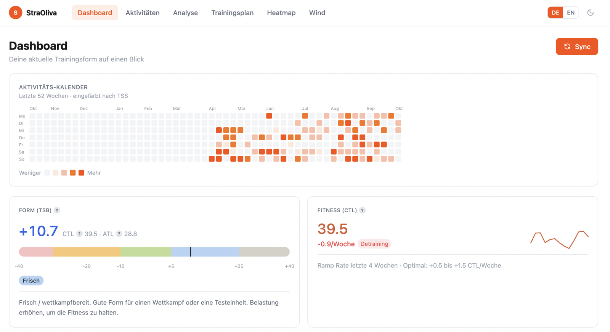
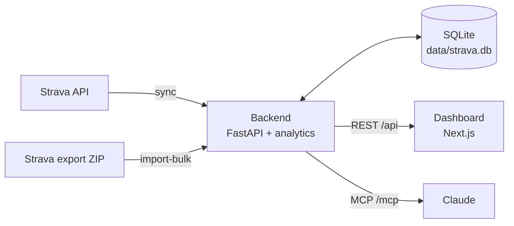

# StraOliva

**A self-hosted training dashboard for your Strava data, with an AI coach built in.**

StraOliva pulls your activities from Strava into a local SQLite database and turns them into the analysis Strava doesn't give you: fitness and fatigue, race predictions, power curve, heart-rate and pace zones, aerobic decoupling and more. An MCP server lets Claude read your training and manage your training plan.

Everything runs on your own machine. Your data never leaves it, apart from the calls to the Strava API.

<!-- Screenshot: add docs/screenshots/dashboard.png and uncomment.
     Leave maps out or blur them; they show where you train.

-->

## Features

- **Dashboard:** form (TSB) gauge, fitness trend (CTL), weekly stats, activity calendar, FTP, threshold pace and max HR (auto-detected).
- **Analytics:** training load (CTL / ATL / TSB), monthly and weekly volume, race predictions (5k to marathon), power-duration curve with CP / W′, time in zone, your personal HR and pace zones, aerobic decoupling and effective pace trends.
- **Activity details:** stream charts with laps, time-in-zone bar, km splits with outliers marked, decoupling, HR drift and TSS.
- **Training plan:** a calendar of structured workouts (warm-up, intervals, targets), shown next to what you actually did.
- **Heatmap:** all your GPS tracks overlaid on one map.
- **Wind & segments:** live wind for your starred Strava segments, showing which ones have a tailwind today.
- **AI coach (MCP):** Claude can read your training state, analyse workouts, predict races and build or adjust your plan.
- **German and English**, light and dark mode, works on phones and installs as an app (PWA).

## How it works



One backend container owns the database. It serves the REST API for the dashboard and the MCP server for Claude, and runs the sync and the analytics.

## Quick start

You need **Docker**, **Python 3.12+** and a **paid Strava subscription**. Since June 2026, Strava only gives API access to developers with a subscription, and StraOliva can't sync without one.

The first setup runs through the `strava-dash` CLI on your machine, **not** through Docker. The Strava login opens a browser and waits for Strava's redirect on `localhost:8888`, which doesn't reach a container. The first import of your history needs the CLI as well. Docker comes last and handles daily use.

**1. Create a Strava API app.** Go to [strava.com/settings/api](https://www.strava.com/settings/api) and set **Authorization Callback Domain** to `localhost`. Everyone uses their own app; there are no shared keys.

**2. Configure.**

```bash
git clone https://github.com/ialqas/StraOliva.git && cd StraOliva
cp .env.example .env    # fill in STRAVA_CLIENT_ID and STRAVA_CLIENT_SECRET
```

**3. Install the CLI and log in to Strava.**

```bash
cd backend
python -m venv .venv && source .venv/bin/activate
pip install -e .
export DB_PATH=../data/strava.db
strava-dash auth
```

The token is stored in `data/strava.db`.

**4. Import your history from a Strava bulk export.** Start with this rather than the Sync button. The Strava API is rate-limited (about 100 requests per 15 minutes and 1,000 per day), and every activity with its sensor data costs several requests. A first sync through the API can't fetch a longer history, while the export contains all of it.

1. On Strava, go to Settings → My Account → *Download or delete your account* → *Request your archive*. Strava emails you a ZIP, which can take a few hours.
2. Import it and compute all analytics (still in `backend/` with the venv active):

   ```bash
   strava-dash import-bulk /path/to/export_12345.zip
   strava-dash recompute --full
   strava-dash sync-segments    # optional: your starred segments, for the wind page
   ```

**5. Start the dashboard.**

```bash
cd ..
docker compose up -d --build
```

Open [http://localhost:3000](http://localhost:3000). From now on, the **Sync** button fetches new activities. Only a few come in at a time, which the rate limit handles easily.

Finish steps 3 and 4 **before** starting the containers, and stop them (`docker compose down`) whenever you use the CLI on your machine again. Only one process should write to the database at a time. Two writers can corrupt it.

## Configuration

All settings live in `.env`. See [.env.example](.env.example) for the full list with comments.

| Setting | Default | What it does |
|---|---|---|
| `STRAVA_CLIENT_ID`, `STRAVA_CLIENT_SECRET` | (required) | Your Strava API app |
| `FTP_W` | auto | Cycling FTP in watts. Auto: best 20 min of the last 90 days × 0.95 |
| `THRESHOLD_PACE_MS` | auto | Run threshold pace in m/s (4.17 = 4:00 /km). Auto: fastest hard 20+ min run of the last 60 days |
| `MAX_HR` | auto | Max heart rate. Auto: highest HR held ≥ 10 s in the last 12 months. Drives all HR zones |
| `REST_HR` | 40 | Resting heart rate, used for HR-based TSS |
| `WIND_CITIES` | empty | Cities for the wind page, e.g. `Munich:48.14:11.58,Berlin:52.52:13.40`. Empty = wind at each segment |
| `HEATMAP_CENTER` | empty | Heatmap start position as `lat:lng`, e.g. `48.14:11.58`. Empty = the area with the most activities |
| `NEXT_PUBLIC_API_URL` | `http://localhost:8000` | Where the browser reaches the backend. Baked in at build time, so rebuild after changing it |
| `CORS_ORIGINS` | `http://localhost:3000` | Origins allowed to call the API |
| `MCP_HTTP_ENABLED` | 1 | Serve the MCP server at `/mcp` |
| `MCP_ALLOWED_HOSTS` | empty | Extra hosts MCP clients may use, e.g. `192.168.1.50:*` |

Values you set are used as-is. Leave them empty to auto-detect them. The dashboard shows each value and whether it is auto-detected or set manually.

## Daily use

The **Sync** button fetches new activities from Strava and recomputes the analytics (TSS, fitness, FTP, power curve, heatmap) for them.

Once the containers are running, run CLI commands inside the backend container so it stays the only process writing to the database:

```bash
docker compose exec backend strava-dash <command>
```

| Command | What it does |
|---|---|
| `sync [--full]` | Fetch new activities (or all of them) from Strava |
| `recompute [--full] [--skip-sync]` | Sync, then recompute analytics. `--full` redoes everything |
| `import-bulk <zip>` | Import a Strava bulk export |
| `sync-segments` | Fetch your starred Strava segments (for the wind page) |
| `sync-splits [--limit N]` | Fetch laps and km splits for runs synced before these were stored |
| `sync-descriptions [--days N]` | Fetch activity descriptions (used by the greetings counter, see below) |

The greetings counter on the dashboard counts runs whose Strava description is nothing but a number: how many people greeted you back.

## AI coach (MCP)

The backend serves an [MCP](https://modelcontextprotocol.io) server, so Claude can work with your training data: current form, workout analysis, race predictions, and creating or adjusting planned workouts.

**Claude Code** (HTTP):

```bash
claude mcp add --transport http straoliva http://localhost:8000/mcp
```

**Claude Desktop** (stdio through the running container). Add this to `claude_desktop_config.json`:

```json
{
  "mcpServers": {
    "straoliva": {
      "command": "docker",
      "args": ["exec", "-i", "straoliva-backend-1", "python", "-m", "app.mcp_server"]
    }
  }
}
```

Check the container name with `docker compose ps`. For the list of tools and example prompts, see [docs/mcp.md](docs/mcp.md).

## Privacy & security

- **Your data stays local.** Activities, GPS tracks and tokens live in `data/` (git-ignored). The only outside calls go to Strava, to [Bright Sky](https://brightsky.dev) for wind (only the segment or city coordinates are sent), and to OpenFreeMap for map tiles.
- **There is no login.** Anyone who can reach port 3000 or 8000 can see all your data, trigger syncs and change your training plan. Run it on your own machine or a trusted home network, or put it behind a VPN or a reverse proxy with authentication. **Do not expose it to the internet.**
- Keep `.env` private; it holds your Strava API secret.

## Limitations

- Built around one athlete and a watch that records laps (Garmin-like). Indoor and manual activities get less analysis.
- Wind data comes from the German weather service (DWD), so the wind page only works in and near Germany.
- The bulk import expects a Strava export in **German** (CSV column names). Other languages need a small change in `backend/app/sync/bulk.py`.
- Running TSS needs a threshold pace and cycling TSS needs an FTP. Without them, HR-based TSS is used.

## Development

```bash
# Backend (from backend/, with the venv active)
pip install -e ".[dev]"
DB_PATH=../data/strava.db uvicorn app.main:app --reload --port 8000
pytest

# Frontend (from frontend/)
npm install
npm run dev
```

Stop the Docker backend while developing against the same database. Two processes writing to SQLite at once can corrupt it.

Reference material:

- [docs/api.md](docs/api.md): REST API endpoints
- [docs/algorithms.md](docs/algorithms.md): how TSS, fitness, zones, predictions and the other metrics are calculated
- [docs/mcp.md](docs/mcp.md): MCP tools and example prompts

## License & disclaimer

[MIT](LICENSE).

Powered by Strava. StraOliva is an independent project and is not affiliated with, endorsed by or sponsored by Strava, Inc. Using it requires your own Strava API application, subject to the [Strava API Agreement](https://www.strava.com/legal/api).
